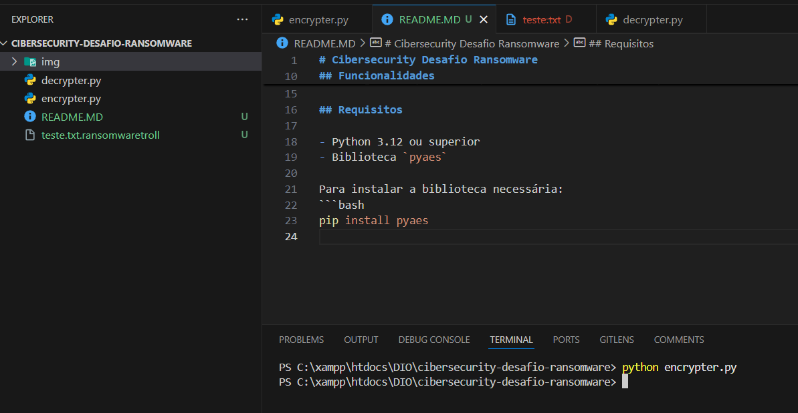

# Cibersecurity Desafio Ransomware

Este projeto é uma demonstração de um script de encriptação desenvolvido como parte de um desafio de cibersegurança. O script utiliza a biblioteca `pyaes` para criptografia de dados.

## Tecnologias Utilizadas

- **Python 3.12**: Linguagem de programação principal.
- **Biblioteca pyaes**: Implementação do algoritmo AES em Python.

## Funcionalidades

- Encriptação de arquivos usando o algoritmo AES.
- Simulação de um ataque ransomware para aprendizado em cibersegurança.
- Configurável para encriptar diferentes tipos de arquivos.

## Requisitos

- Python 3.12 ou superior
- Biblioteca `pyaes`

Para instalar a biblioteca necessária:
```bash
pip install pyaes
```

## Como Executar

1. Clone o repositório:
   ```bash
   git clone https://github.com/seuusuario/cibersecurity-desafio-ransomware.git
   ```
2. Navegue até o diretório do projeto:
   ```bash
   cd cibersecurity-desafio-ransomware
   ```
3. Execute o script:
   ```bash
   python encrypter.py
   ```

## Exemplo de Execução

Abaixo está um exemplo de como o script funciona:



> **Nota**: Certifique-se de ter um backup dos seus arquivos antes de executar o script, pois ele encripta os dados.

## Contribuições

Contribuições são bem-vindas! Sinta-se à vontade para abrir uma issue ou enviar um pull request.

## Licença

Este projeto é distribuído sob a licença MIT. Consulte o arquivo `LICENSE` para mais detalhes.
